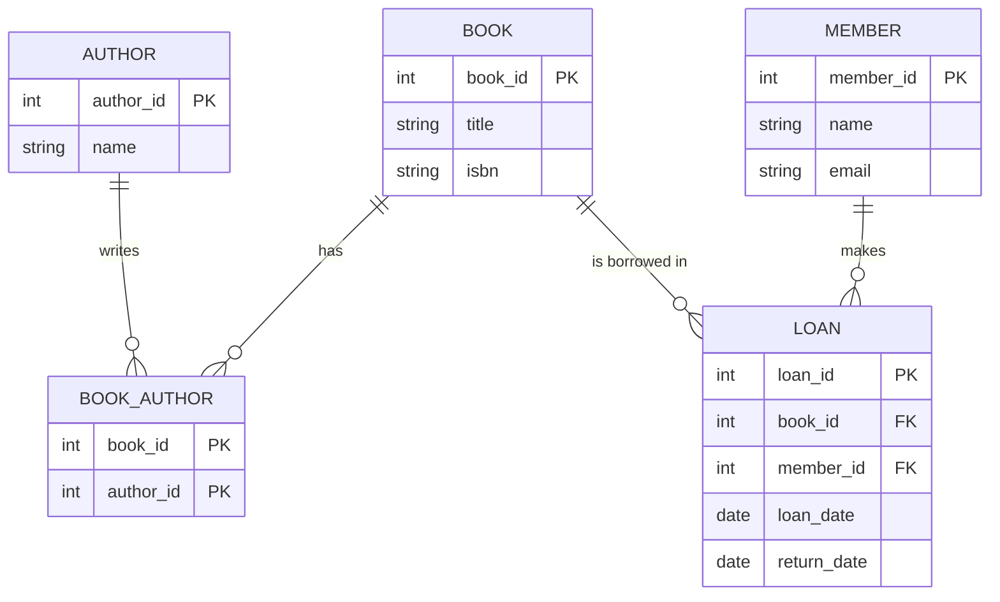

# ER diagram: Library Management System

```mermaid
erDiagram
    BOOK ||--o{ BOOK_AUTHOR : has
    AUTHOR ||--o{ BOOK_AUTHOR : writes
    MEMBER ||--o{ LOAN : makes
    BOOK ||--o{ LOAN : "is borrowed in"
    BOOK { int book_id PK
      string title
      string isbn }
    AUTHOR { int author_id PK
      string name }
    BOOK_AUTHOR { int book_id PK
      int author_id PK }
    MEMBER { int member_id PK
      string name
      string email }
    LOAN { int loan_id PK
      int book_id FK
      int member_id FK
      date loan_date
      date return_date }
```
